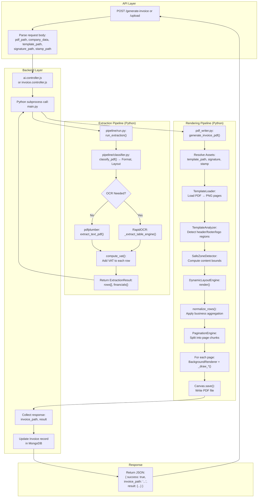
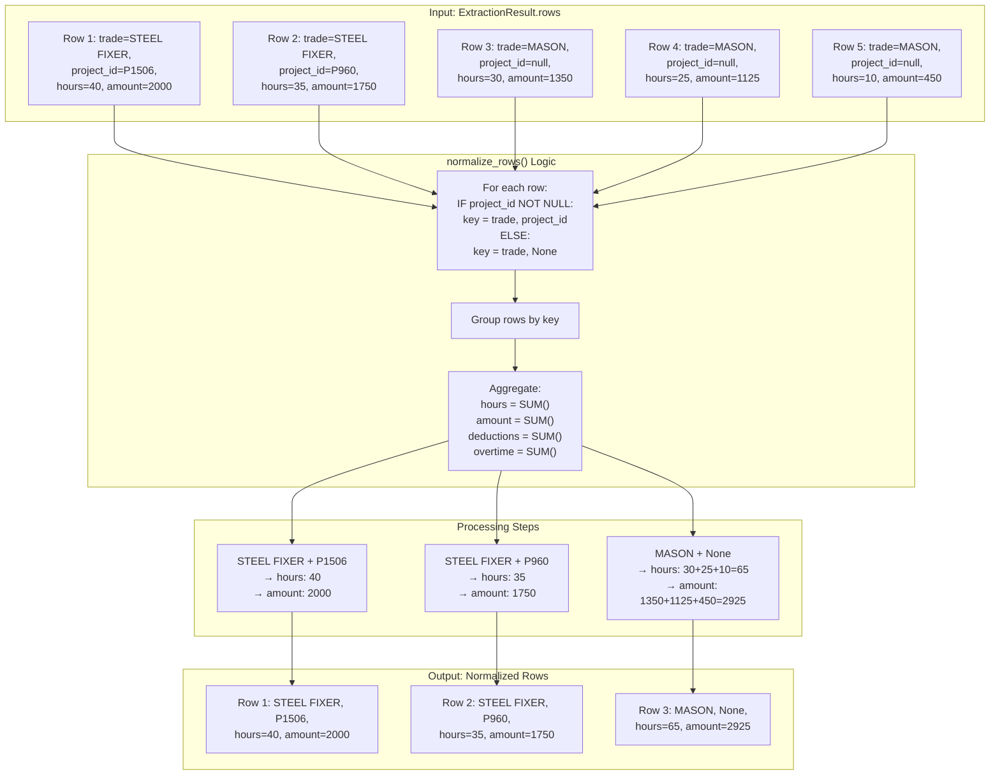
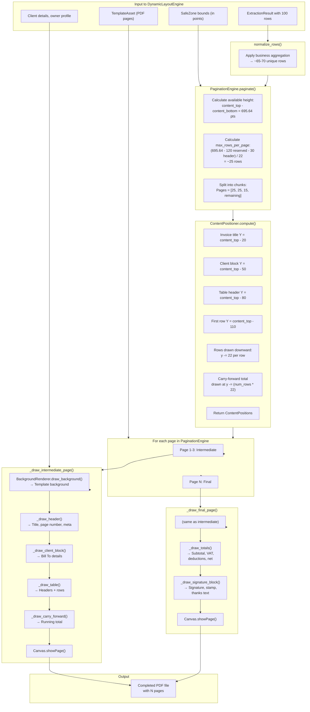
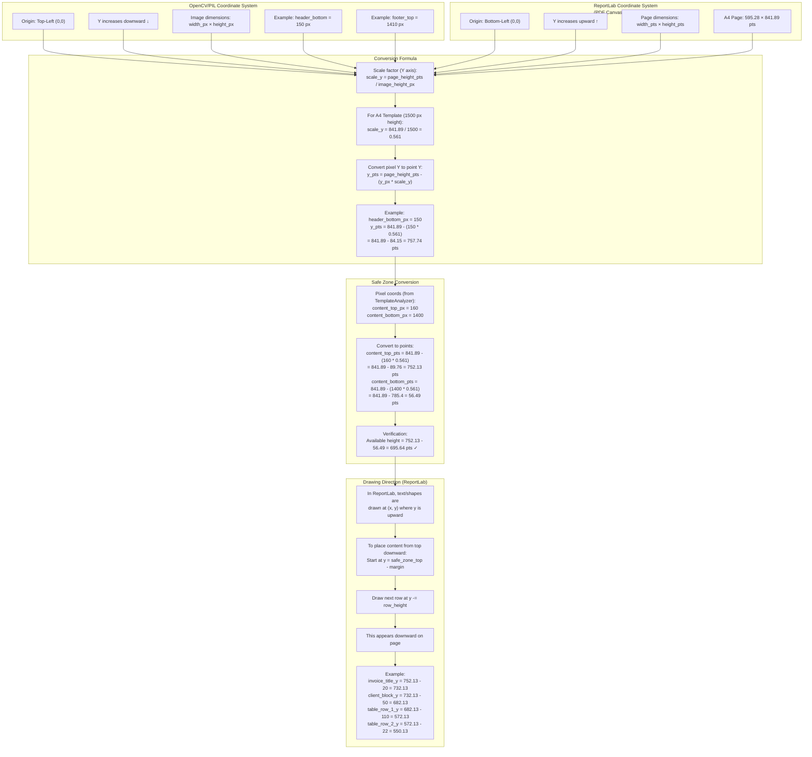
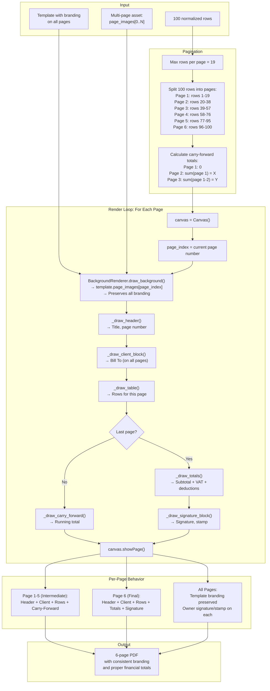

# DETAILED FLOW DIAGRAMS

This document contains comprehensive Mermaid diagrams showing actual execution flow, business logic, template rendering, and OCR routing.

---

## DIAGRAM A: COMPLETE REQUEST → RESPONSE FLOW

Shows the full path from API request through extraction, rendering, and response.



---

## DIAGRAM B: BUSINESS NORMALIZATION FLOW

Shows how extraction rows are transformed by business rules (conditional aggregation).



---

## DIAGRAM C: TEMPLATE ANALYSIS & SAFE-ZONE DETECTION

Shows how templates are analyzed for branding regions and safe content area computed.

```mermaid
flowchart TD
    subgraph Input["Input: Template PDF"]
        I1["File: template.pdf"]
    end
    
    subgraph Load["TemplateLoader"]
        L1["Load PDF → PIL Image<br/>at 200 DPI"]
        L2["Convert to NumPy array<br/>BGR color space"]
    end
    
    subgraph Analyze["TemplateAnalyzer.analyze()"]
        A1["Preprocessing:<br/>Grayscale + Blur"]
        A2["Whitespace Projection:<br/>row_dark, col_dark"]
        A3["Find Transitions:<br/>header_bottom,<br/>footer_top"]
        A4["Density Analysis:<br/>Find logo regions,<br/>watermark regions"]
        A5["Return TemplateAnalysis:<br/>{ header_bottom_px,<br/>footer_top_px,<br/>logo_regions[],<br/>watermark_regions[] }"]
    end
    
    subgraph SafeZone["SafeZoneDetector.detect()"]
        SZ1["Input: TemplateAnalysis,<br/>image_shape"]
        SZ2["content_top = header_bottom + 10px<br/>(margin)"]
        SZ3["content_bottom = footer_top - 10px<br/>(margin)"]
        SZ4["content_left = max(logo region)<br/>+ 10px margin"]
        SZ5["content_right = min(page_width,<br/>min(logo region) - 10px)"]
        SZ6["Return SafeZone:<br/>{ content_top_px,<br/>content_bottom_px,<br/>content_left_px,<br/>content_right_px }"]
    end
    
    subgraph Convert["Scale to Points"]
        C1["scale_y = 841.89 / image_height_px"]
        C2["content_top_pts =<br/>841.89 - (content_top_px * scale_y)"]
        C3["content_bottom_pts =<br/>841.89 - (content_bottom_px * scale_y)"]
        C4["Return SafeZone in points"]
    end
    
    subgraph Example["Example A4 Template"]
        EX1["Image: 1200×1500 px<br/>scale_y = 841.89/1500 = 0.561"]
        EX2["Header detected at: 150 px<br/>content_top = 150 + 10 = 160 px"]
        EX3["Footer detected at: 1410 px<br/>content_bottom = 1410 - 10 = 1400 px"]
        EX4["Pixel coords:<br/>{ top: 160, bottom: 1400 }"]
        EX5["Point coords:<br/>{ top: 841.89 - 89.76 = 752.13 pts,<br/>bottom: 841.89 - 785.4 = 56.49 pts }"]
    end
    
    I1 --> L1
    L1 --> L2
    L2 --> A1
    A1 --> A2
    A2 --> A3
    A3 --> A4
    A4 --> A5
    A5 --> SZ1
    SZ1 --> SZ2
    SZ2 --> SZ3
    SZ3 --> SZ4
    SZ4 --> SZ5
    SZ5 --> SZ6
    SZ6 --> C1
    C1 --> C2
    C2 --> C3
    C3 --> C4
    C4 --> EX1
    EX1 --> EX2
    EX2 --> EX3
    EX3 --> EX4
    EX4 --> EX5
```



---

## DIAGRAM D: PAGINATION & LAYOUT RENDERING

Shows how content is split into pages and rendered with proper positioning.



---

## DIAGRAM E: OCR ROUTING DECISION TREE

Shows how the system intelligently routes between pdfplumber and RapidOCR.

```mermaid
flowchart TD
    subgraph Start["Input: PDF File"]
        S1["pdf_path"]
    end
    
    subgraph Classify["Classify PDF"]
        C1["pipeline/classifier.py:<br/>classify_pdf()"]
        C2["→ format: TimesheetFormat<br/>→ layout: LayoutType<br/>→ is_image: bool"]
    end
    
    subgraph Decision["text_extractor.py:<br/>_should_use_ocr_pipeline()"]
        D1["Step 1: Extract text<br/>using pdfplumber"]
        D2{"Check: text_volume<br/>&lt; 700 chars?"}
        D3{"Check: attachment_heavy<br/>AND no_rows?<br/>tokens ≥ 20"}
        D4{"Check: format in BKC/GENERIC<br/>AND no_rows?"}
        D5["Return: use_ocr = FALSE<br/>→ Use pdfplumber"]
        D6["Return: use_ocr = TRUE<br/>→ Use RapidOCR"]
    end
    
    subgraph pdfplumber["pdfplumber Route"]
        PDF1["Extract text-based table:<br/>_extract_pdf_text_tables()"]
        PDF2["Clean column alignment"]
        PDF3["Parse rows into:<br/>trade, project_id, hours, etc."]
    end
    
    subgraph RapidOCR["RapidOCR Route"]
        OCR1["Convert PDF pages to images<br/>pdf2image @ 200 DPI"]
        OCR2["Detect tables via morphology:<br/>table_detector.py"]
        OCR3["Extract OCR + grid structure:<br/>_extract_table_engine()"]
        OCR4["Reconstruct grid:<br/>grid_reconstructor.py"]
        OCR5["Normalize cells:<br/>table_normalizer.py"]
    end
    
    subgraph Common["Common Processing"]
        COMM1["normalize_rows():<br/>Group by (trade, project_id)"]
        COMM2["compute_vat():<br/>Apply VAT rate"]
        COMM3["Return ExtractionResult"]
    end
    
    subgraph TestCases["Test Coverage"]
        TC1["✅ Clean Text (1328 chars)<br/>→ pdfplumber"]
        TC2["✅ Low Text (24 chars)<br/>→ OCR"]
        TC3["✅ Attendance-Heavy (47 tokens)<br/>→ OCR"]
        TC4["✅ BKC Format (no rows)<br/>→ OCR"]
        TC5["✅ MCC Format (rows)<br/>→ pdfplumber"]
    end
    
    S1 --> C1
    C1 --> C2
    C2 --> D1
    D1 --> D2
    D2 -->|Yes (<700)| D6
    D2 -->|No| D3
    D3 -->|Yes| D6
    D3 -->|No| D4
    D4 -->|Yes| D6
    D4 -->|No| D5
    D5 --> PDF1
    D6 --> OCR1
    PDF1 --> PDF2
    PDF2 --> PDF3
    PDF3 --> COMM1
    OCR1 --> OCR2
    OCR2 --> OCR3
    OCR3 --> OCR4
    OCR4 --> OCR5
    OCR5 --> COMM1
    COMM1 --> COMM2
    COMM2 --> COMM3
    COMM3 --> TC1
    COMM3 --> TC2
    COMM3 --> TC3
    COMM3 --> TC4
    COMM3 --> TC5
```

---

## DIAGRAM F: COORDINATE SYSTEM TRANSFORMATION

Shows the critical coordinate system conversion between OpenCV (template analysis) and ReportLab (rendering).



---

## DIAGRAM G: MULTI-PAGE TEMPLATE RENDERING

Shows how template branding is preserved and content split across multiple pages.



---

End of Flow Diagrams
